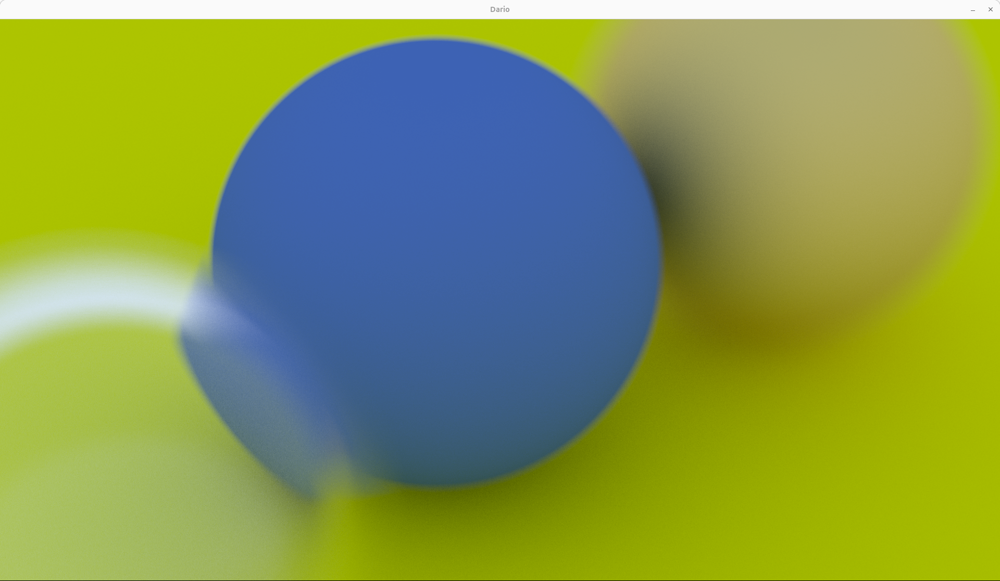

# Raytracing with Cuda
### Juno Linux Laptop
### OS: Ubuntu 24.01
### Cuda: 12.6 
### Driver: 560.35.03
### Nvidia Card: NVIDIA GeForce RTX 4090 16G

I started with Chapter 13 defocus Blur

# Chapter 13.  DeFocus Blur

### Sample - 500 samples and 100 depth : 39.64 secs  1920 x 1080
 

