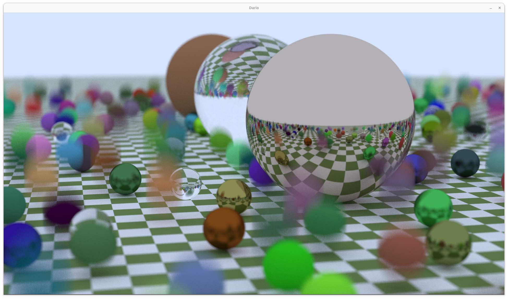
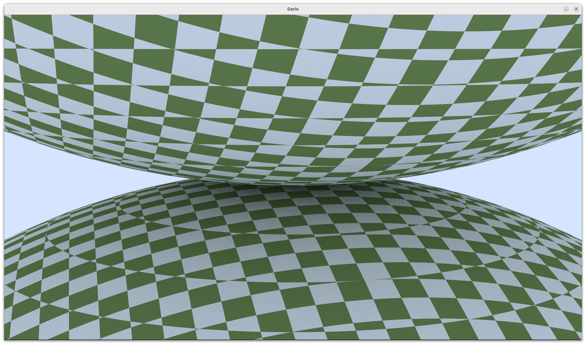
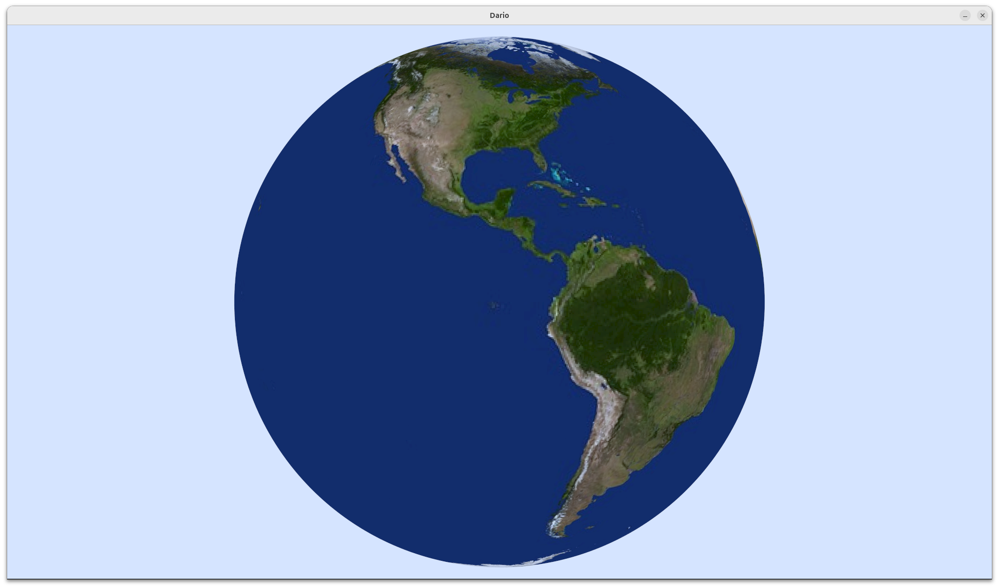
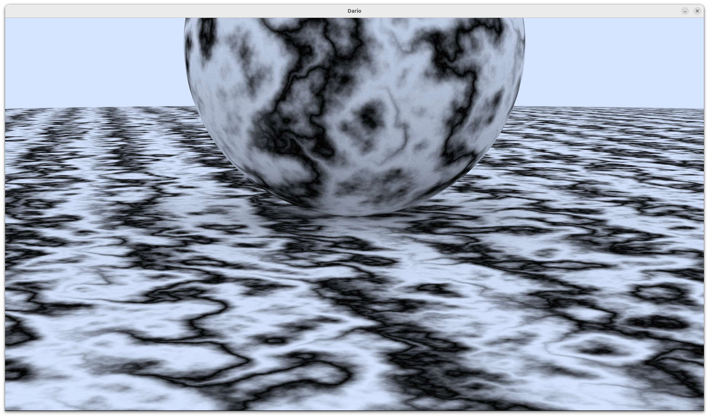
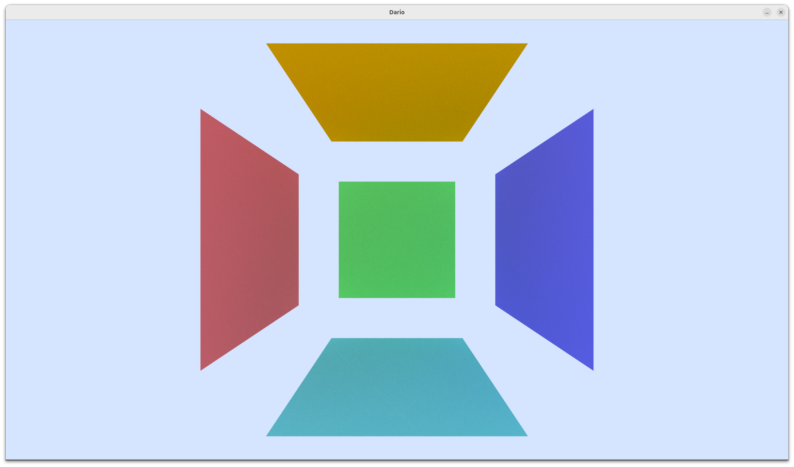
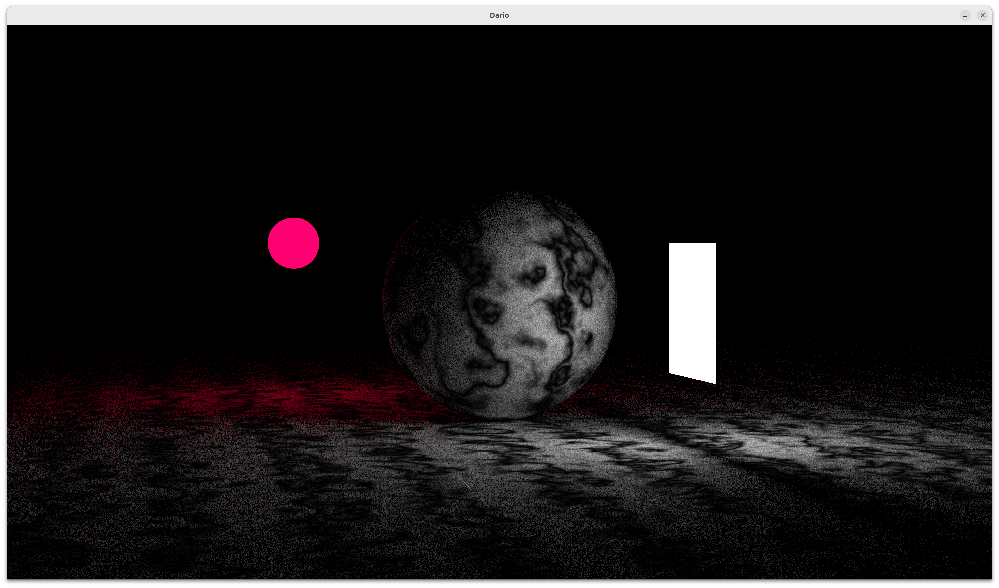
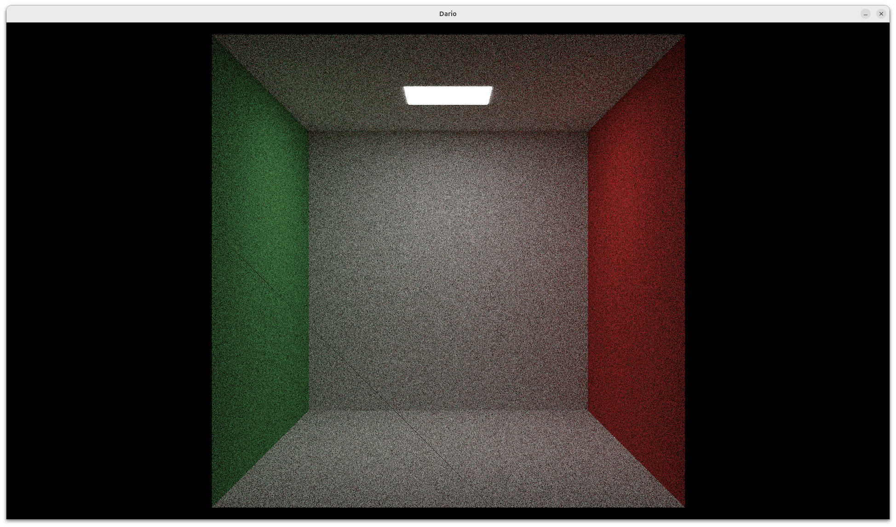
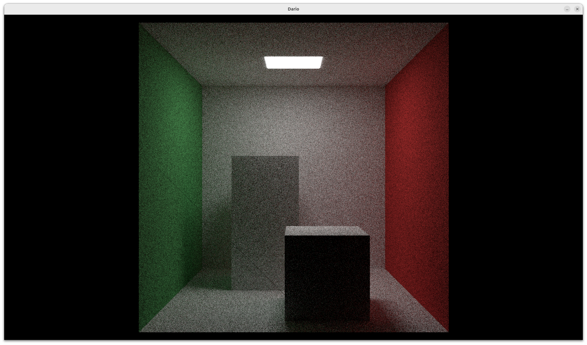
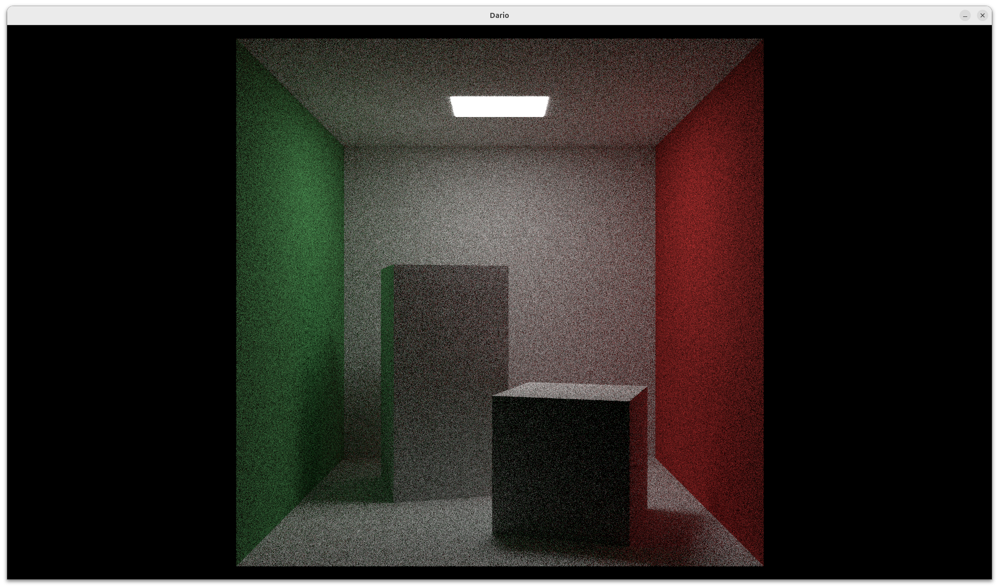

# Raytracing with Cuda
### Juno Linux Laptop
### OS: Ubuntu 24.01
### Cuda: 12.6 
### Driver: 560.35.03
### Nvidia Card: NVIDIA GeForce RTX 4090 16G

I started with Chapter 13 defocus Blur

# Chapter 13.  DeFocus Blur  - main branch
### Sample - 500 samples and 100 depth : 39.64 secs  1920 x 1080
 

# Chapter 14.  final render  - MULTIPLE SPHERES
### Sample - 500 samples and 100 depth : 48.65368 secs  1440 X 720
### Sample - 500 samples and 100 depth : 95.69674 secs  1920 x 1080

# BOOK 2: Chapter 2.   - MOTION BLUR
<!-- ### Sample - 500 samples and 100 depth : 48.65368 secs  1440 X 720 -->
### Sample - 500 samples and 100 depth : 103.826068 secs  1920 x 1080

# BOOK 2: Chapter 3.  AABB and BVH nodes. with "optimization" per instructed in section 3.10
##  BVH node_build RECURSIVE construction done in CPU   BVH.hit() NON-RECURSIVE function in GPU
   Results:   Not efficient yet   with aabb takes 32 seconds.  NO BOXES like chp2 takes only 15 seconds.
##  BVH2 node_build NON-RECURSIVE construction OF FLAT NODES done in CPU   BVH.hit() NON-RECURSIVE function in GPU
   Results: NOT EFFICIENT either.  with aabb takes 32 seconds.  NO BOXES like chp2 takes only 15 seconds.

   another comparison:
   * at 500 samples 100 depth  ...using BVH2   1920x1080 NUC-computer  420.000650  seconds!!!!!  too slow
   , 418.699608
   * with NO aabb just as chap2 (motion blur)  1290x1080 NUC-computer  198.905236  seconds!!!!!  50% FASTER!!! NO BOXES!!!

   (198.91 - 420.00) / 198.91 = BOXES (NOT EFFICIENT FOR CUDA) = 111.15 %  SLOWER

   or

   (420.00 - 198.91) / 420.00 = NO BOXES just like cha2 Motion Blur CUDA = 52.6 % FASTER

## MOVED BVH2 node_build NON-RECURSIVE construction OF FLAT NODES to GPU as kernel   BVH.hit() NON-RECURSIVE function in GPU  
* at 500 samples 100 depth  1920x1080 NUC-computer  375.000650 , 372.935474 354.97 seconds!!!!!   still too slow but faster than above

 (198.91 - 354.97) / 198.91 = BOXES (NOT EFFICIENT FOR CUDA) = 78.45 %  SLOWER (negative)

   or

(354.97 - 198.91) / 354.97 = NO BOXES just like cha2 Motion Blur CUDA = 43.9 % FASTER

# BVH sample times and NON-BVH samples
## Observation: CUDA BVH samples are best and faster when number of hittables is really big (1500+ hittables). Otherwise, stick with direct hit (no bvh boxes)

# NEXT WEEK CHAP 4:  TEXTURE MAPPING
## Samples - 200 samples and 50 depth 1920 X 1080 portable display -  NIC-intel  RTX-3060 
### Chap 4.1 "Bouncing spheres"  
### BVH OFF:  RTX-3060 36.3 sec  RTX4090: 7.5 sec  
### BVH ON:   RTX-3060 72.9 sec  RTX4090: 11.5 sec  

### Chap 4.3 "Checkered spheres" 
### BVH OFF:  RTX-3060 24.2 sec RTX4090: 3.9 sec
### BVH ON:   RTX-3060 26.2 sec RTX4090: 4.2 sec

### Chap 4.5  Image textures:  "Earth" 
### BVH OFF:  RTX-3060 2.2 sec RTX4090: 0.37 sec 
### BVH ON:   RTX-3060 2.5 sec RTX4090: 0.4 sec

# NEXT WEEK CHAP 5:  PERLIN NOISE
### Chap 5.7 "Perlin spheres" 
### BVH OFF:  RTX-3060 15.9 sec RTX4090: 2.6 sec
### BVH ON:   RTX-3060 17.6 sec RTX4090: 2.9 sec

# NEXT WEEK CHAP 6: QUADRILATERALS
### Chap 6.6 "quads" 
### BVH OFF:  RTX-3060 4.2 sec RTX4090: 0.7 sec
### BVH ON:   RTX-3060 5.5 sec RTX4090: 0.9 sec

# NEXT WEEK CHAP 7: LIGTHS
### Chap 7.3 "Simplelights" 
### BVH OFF:  RTX-3060 7.3 sec RTX4090: 1.3 sec
### BVH ON:   RTX-3060 9.2 sec RTX4090: 1.6 sec

### Chap 7.4 "Cornellbox" 
### BVH OFF:  RTX-3060 26.4 sec RTX4090: 4.3 sec
### BVH ON:   RTX-3060 36.8 sec RTX4090: 5.9 sec

### Chap 8  Intances "Cornellbox2" 
### BVH OFF:  RTX-3060 38.7 sec RTX4090: 6.1 sec
### BVH ON:   RTX-3060 71.1 sec RTX4090: 11.3 sec

### Chap 8 ROTATION & TRANSLATION Intances "CornellboxInstances" 
### BVH OFF:  RTX-3060 60.0 sec RTX4090: 11.0 sec
### BVH ON:   RTX-3060 84.1 sec RTX4090: 13.9 sec 

