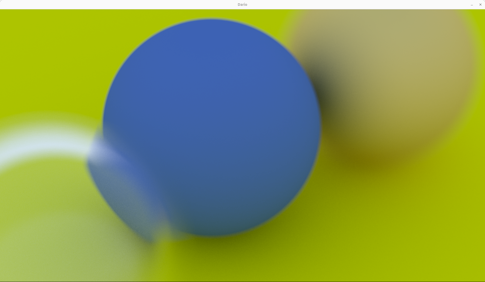
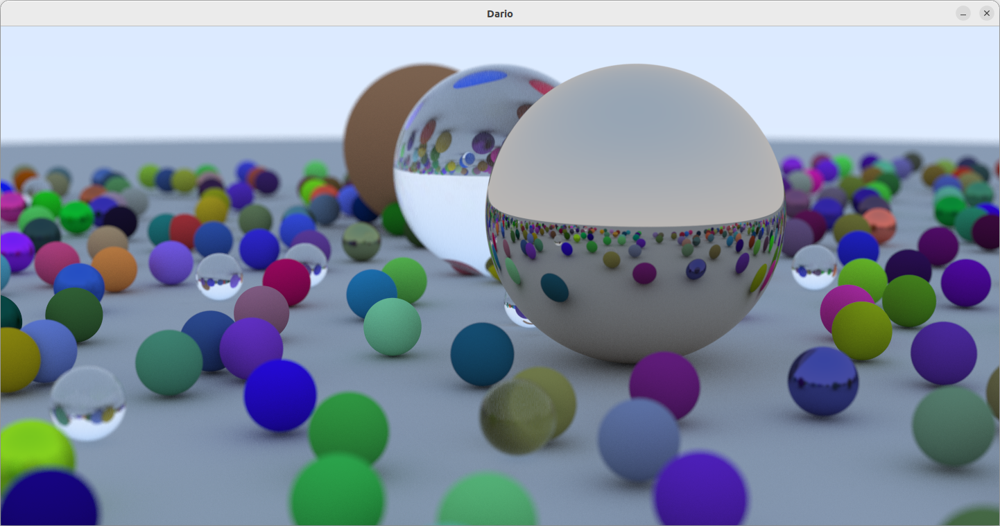
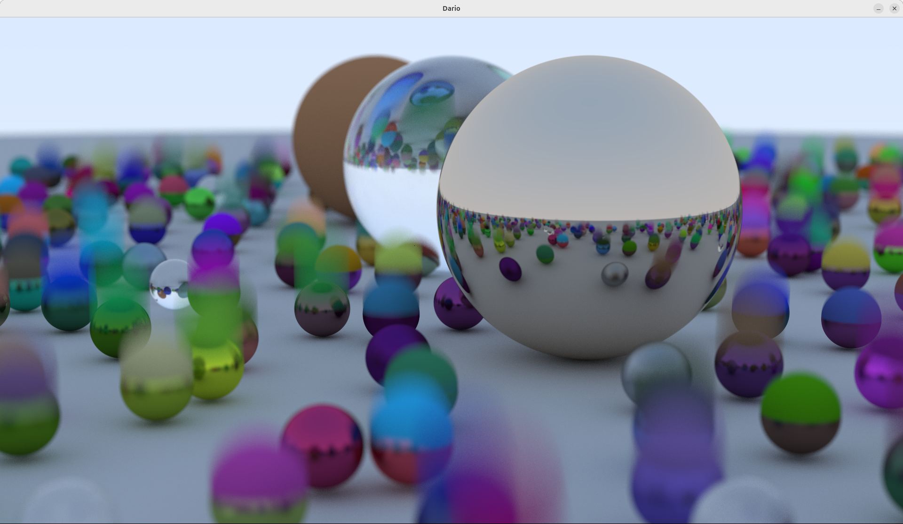

# Raytracing with Cuda
### Juno Linux Laptop
### OS: Ubuntu 24.01
### Cuda: 12.6 
### Driver: 560.35.03
### Nvidia Card: NVIDIA GeForce RTX 4090 16G

I started with Chapter 13 defocus Blur

# Chapter 13.  DeFocus Blur  - main branch
### Sample - 500 samples and 100 depth : 39.64 secs  1920 x 1080
 

# Chapter 14.  final render  - MULTIPLE SPHERES
### Sample - 500 samples and 100 depth : 48.65368 secs  1440 X 720
### Sample - 500 samples and 100 depth : 95.69674 secs  1920 x 1080

# BOOK 2: Chapter 2.   - MOTION BLUR
<!-- ### Sample - 500 samples and 100 depth : 48.65368 secs  1440 X 720 -->
### Sample - 500 samples and 100 depth : 103.826068 secs  1920 x 1080

# BOOK 2: Chapter 3.  AABB and BVH nodes. with "optimization" per instructed in section 3.10
##  BVH node_build RECURSIVE construction done in CPU   BVH.hit() NON-RECURSIVE function in GPU
   Results:   Not efficient yet   with aabb takes 32 seconds.  NO BOXES like chp2 takes only 15 seconds.
##  BVH2 node_build NON-RECURSIVE construction OF FLAT NODES done in CPU   BVH.hit() NON-RECURSIVE function in GPU
   Results: NOT EFFICIENT either.  with aabb takes 32 seconds.  NO BOXES like chp2 takes only 15 seconds.

   another comparison:
   * at 500 samples 100 depth  ...using BVH2   1920x1080 NUC-computer  420.000650  seconds!!!!!  too slow
   * with NO aabb just as chap2 (motion blur)  1290x1080 NUC-computer  198.905236  seconds!!!!!  50% FASTER!!! NO BOXES!!!

   (198.91 - 420.00) / 198.91 = BOXES (NOT EFFICIENT FOR CUDA) = 111.15 %  SLOWER

   or

   (420.00 - 198.91) / 420.00 = NO BOXES just like cha2 Motion Blur CUDA = 52.6 % FASTER